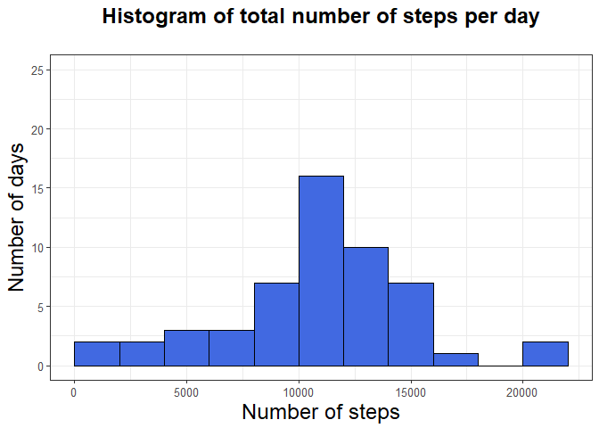
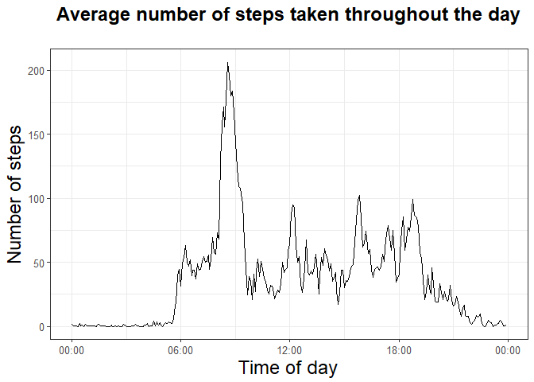
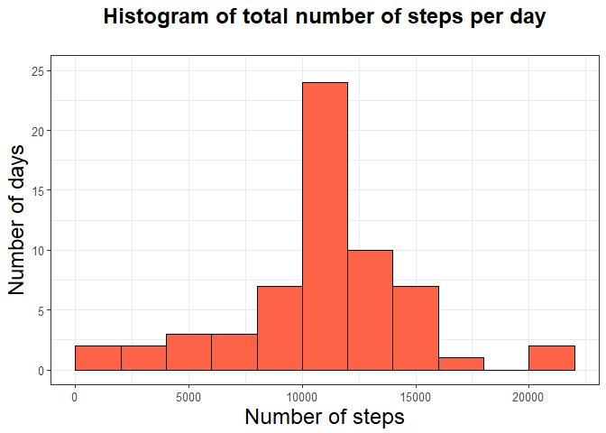
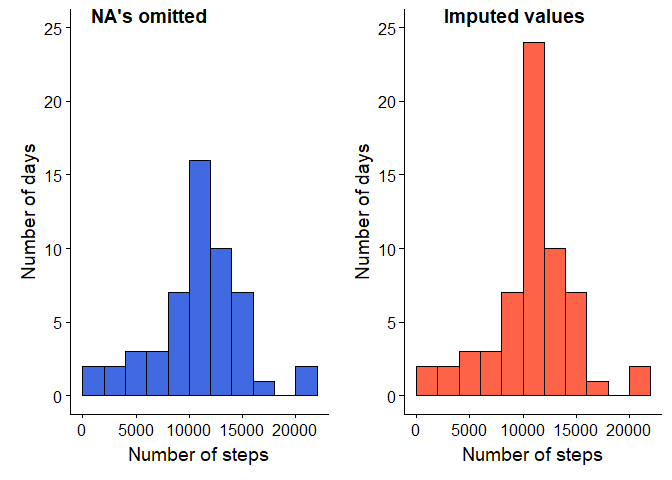
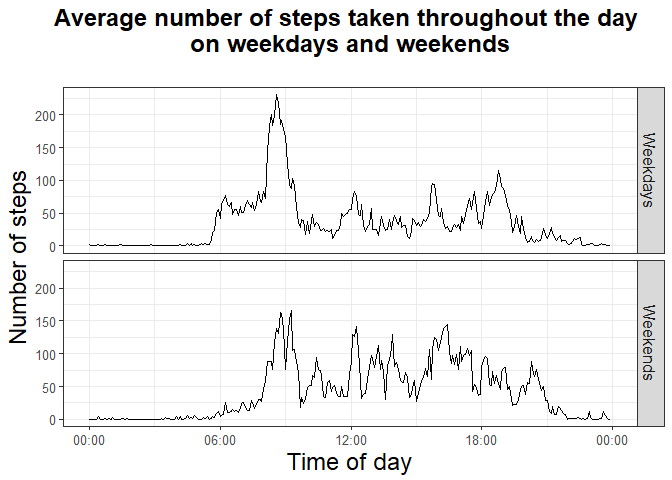

# Reproducible Research: Peer Assessment 1

# Tracking Your Steps

<br>

I've been given a dataset that contains data from a personal activity monitoring device, so what better to do
with it than to make some pretty plots!

## Loading and preprocessing the data

<br>

I've moved my working directory into the **RepData_PeerAssessment1** folder, so let's go ahead and read in
the zipped csv file containing the data:


```r
file <- unz(description = "./activity.zip", filename = "activity.csv")
activity <- read.csv(file = file)
```
<br>

Briefly, the dataset measures the number of steps taken in 5-minute intervals over the course of two months
(61 days). Here are the variables:  
<br>
* **steps** - number of steps  
* **date** - date (duh...)  
* **interval** - identifier for each 5 minute interval in a day  
<br>
The first thing I'm going to do is add some variables to the dataset:  
<br>
* **date.time** - combines **date** and **interval** into a datetime format  
* **day.type** - takes on a value of either 'weekday' or 'weekend'  
* **time** - contains the same information contained in **interval** but formatted as a time  
<br>
Here's the code and a peek at what the dataset now looks like:


```r
library(lubridate)
library(dplyr)
library(stringr)

ndays <- length(unique(activity$date)) # dataset contains data from 61 days (2 months)
nintervals <- activity %>% # there are 288 observations from each day
        count(date) %>% 
        select(n) %>% 
        first %>% 
        first 
activity <- activity %>% 
        mutate(date = ymd(date),
               minutes = rep(seq(from = 0, to = (nintervals -1)*5, by = 5), times = ndays),
               hours = floor(minutes/60),
               minutes = minutes - (60 * hours),
               hms = str_c(hours, minutes, 0, sep = ":"),
               date.time = as.POSIXct(date + hms(hms)),
               time = as.POSIXct(hms, format = "%H:%M:%S"),
               day.type = ifelse(wday(date.time) %in% 2:6, "weekday", "weekend")) %>% 
        select(-c(minutes, hours, hms))

head(activity, 3)
```

```
##   steps       date interval           date.time                time
## 1    NA 2012-10-01        0 2012-10-01 00:00:00 2017-08-03 00:00:00
## 2    NA 2012-10-01        5 2012-10-01 00:05:00 2017-08-03 00:05:00
## 3    NA 2012-10-01       10 2012-10-01 00:10:00 2017-08-03 00:10:00
##   day.type
## 1  weekday
## 2  weekday
## 3  weekday
```
<br>

Now let's start answering some questions.  

<br>

## What is the mean total number of steps taken per day?

<br>

At some point we may have to do something about the missing values in the **steps** variable, but for now
let's just omit them. First we'll calculate the total number of steps that were taken for each day
in the dataset and look at its distribution.


```r
# Calculate step totals by date (NA's omitted)
total.steps <- activity %>% 
        filter(is.na(steps) == FALSE) %>% 
        group_by(date) %>% 
        summarize(total.steps = sum(steps))

library(ggplot2)

# theme just makes the plot pretty
theme <- theme_bw() +
        theme(plot.title = element_text(size = 18, hjust = .5,
                                        face = "bold", margin = margin(0,0,25,0)),
              axis.title = element_text(size = 18),
              axis.text = element_text(size = 10),
              strip.text = element_text(size = 12))

# Make a histogram of step totals
plot1 <- ggplot(total.steps, aes(x = total.steps))
plot1 <- plot1 + geom_histogram(binwidth = 2000, color = "black",
                                fill = "royalblue", boundary = 0) +
        labs(title = "Histogram of total number of steps per day",
             x = "Number of steps",
             y = "Number of days") +
        theme +
        ylim(0,25)
plot1
```

<!-- -->
<br>

Based on the histogram, it looks like the average number of steps this guy (let's call him Todd) takes in a day is probably somewhere around 11,000 steps. Let's check:


```r
# Calculate mean and median step totals
mm.total.steps <- total.steps %>%
        summarize(mean = mean(total.steps),
                  median = median(total.steps))
mm.total.steps
```

```
## # A tibble: 1 x 2
##       mean median
##      <dbl>  <int>
## 1 10766.19  10765
```
<br>

Pretty close! Just under 11,000 steps a day on average.

<br>

## What is the average daily activity pattern?

<br>

Now let's make a plot that shows what times of the day Todd is moving around the most. First we'll
calculate the average number of steps for each time interval across all two months.


```r
# Calculate the average number of steps for each time interval throughout the day.
pattern.steps <- activity %>% 
        filter(is.na(steps) == FALSE) %>%  
        group_by(time) %>% 
        summarize(mean = mean(steps)) %>%
        arrange(time)

plot2 <- ggplot(pattern.steps, aes(time, mean))
plot2 <- plot2 + geom_line() +
        scale_x_datetime(date_labels = "%H:%M") +
        labs(title = "Average number of steps taken throughout the day",
             x = "Time of day",
             y = "Number of steps") +
        theme
plot2
```

<!-- -->
<br>

It looks like Todd is walking a lot during the day and hardly at all during the night. I think we can safely conclude that Todd is not a sleepwalker. There's also a sharp peak in activity just before 9:00 AM. Maybe Todd likes to go running in the morning? Let's find out exactly what time corresponds to the peak:


```r
# Find the max step count
pattern.steps[which.max(pattern.steps$mean),]
```

```
## # A tibble: 1 x 2
##                  time     mean
##                <dttm>    <dbl>
## 1 2017-08-03 08:35:00 206.1698
```
<br>

So the five-minute interval spanning from 8:35 - 8:40 AM is when Todd is taking the most number of steps in the day. 

<br>

## Imputing missing values

<br>

So far we've ignored the missing values in the **step** variable. Now let's try imputing values in their place. First let's see where the missing values occur.


```r
sum(!complete.cases(activity)) # there are 2304 missing values
```

```
## [1] 2304
```

```r
missing <- activity[!complete.cases(activity),]
missing %>% count(date) # Only 8 days have missing values.
```

```
## # A tibble: 8 x 2
##         date     n
##       <date> <int>
## 1 2012-10-01   288
## 2 2012-10-08   288
## 3 2012-11-01   288
## 4 2012-11-04   288
## 5 2012-11-09   288
## 6 2012-11-10   288
## 7 2012-11-14   288
## 8 2012-11-30   288
```
<br>

There are eight days where all the values are missing, but the rest of the dataset is complete. Let's try imputing the mean step total of each time interval that we calculated earlier into the missing values.


```r
activity2 <- activity %>% 
        left_join(pattern.steps, by = "time") %>% 
        mutate(steps = ifelse(is.na(steps) == TRUE, mean, steps)) %>% 
        select(-mean)
pattern.steps[1,] #mean value we calculated
```

```
## # A tibble: 1 x 2
##         time     mean
##       <dttm>    <dbl>
## 1 2017-08-03 1.716981
```

```r
head(activity2, 3)
```

```
##       steps       date interval           date.time                time
## 1 1.7169811 2012-10-01        0 2012-10-01 00:00:00 2017-08-03 00:00:00
## 2 0.3396226 2012-10-01        5 2012-10-01 00:05:00 2017-08-03 00:05:00
## 3 0.1320755 2012-10-01       10 2012-10-01 00:10:00 2017-08-03 00:10:00
##   day.type
## 1  weekday
## 2  weekday
## 3  weekday
```
<br>

You can see now the the mean value we calculated in **pattern.steps** now appears in **steps** where there used to be missing values. Sweet! Now let's take a look at that histogram again:


```r
# Re-calculate step totals
total.steps2 <- activity2 %>% 
        group_by(date) %>% 
        summarize(total.steps = sum(steps))

# Make a histogram
plot3 <- ggplot(total.steps2, aes(x = total.steps))
plot3 <- plot3 + geom_histogram(binwidth = 2000, boundary = 0,
                                col = "black", fill = "tomato") +
        labs(title = "Histogram of total number of steps per day",
             x = "Number of steps",
             y = "Number of days") +
        ylim(0,25) +
        theme
plot3
```

<!-- -->
<br>

It looks basically the same as before. In fact, if you put it right next to the first graph, you'll find that the only bar that changed is the one right in the middle where the mean is:


```r
library(cowplot)

plot1.3 <- ggplot(total.steps, aes(total.steps)) + 
        geom_histogram(binwidth = 2000, boundary = 0, color = "black", fill = "royalblue") +
        ylim(0, 25) +
        labs(x = "Number of steps",
             y = "Number of days")
plot3.1 <- ggplot(total.steps2, aes(total.steps)) + 
        geom_histogram(binwidth = 2000, boundary = 0, color = "black", fill = "tomato") +
        ylim(0, 25) +
        labs(x = "Number of steps",
             y = "Number of days")
plot4 <- plot_grid(plot1.3, plot3.1, align = "h", labels = c("NA's omitted", "Imputed values"),
                     hjust = -.75)
plot4
```

<!-- -->
<br>

You can also calculate the new mean and median directly to compare them:


```r
# Calculate the new mean and median step totals
mm2 <- total.steps2 %>% 
        summarize(mean = mean(total.steps),
                  median = median(total.steps))

# Imputing values hasn't changed the mean or median at all

mm.total.steps # original calculations
```

```
## # A tibble: 1 x 2
##       mean median
##      <dbl>  <int>
## 1 10766.19  10765
```

```r
mm2 # second calculations
```

```
## # A tibble: 1 x 2
##       mean   median
##      <dbl>    <dbl>
## 1 10766.19 10766.19
```
<br>

As you can see, the mean and median have hardly changed from before when they were calculated without the imputed values.

<br>

Now onto the last question...

<br>

## Are there differences in activity patterns between weekdays and weekends?

<br>

To answer this we'll calculate the average number of steps per five-minute interval on weekdays and compare that to weekends. Here's the code:

```r
# Calculate average step totals
wday.patterns <- activity2 %>% 
        group_by(day.type, time) %>% 
        summarize(mean = mean(steps)) %>% 
        arrange(day.type, time)

labels <- c(weekday = "Weekdays", weekend = "Weekends") # Make strip labels prettier
plot5 <- ggplot(wday.patterns, aes(time, mean)) # Make the plot
plot5 <- plot5 + geom_line() +
        facet_wrap(~day.type, nrow = 2,
                   labeller = labeller(day.type = labels),
                   strip.position = "right") +
        scale_x_datetime(date_labels = "%H:%M") +
        labs(title = "Average number of steps taken throughout the day \non weekdays and weekends",
             x = "Time of day",
             y = "Number of steps") +
        theme
plot5
```

<!-- -->
<br>

Perfect! It looks, well, mostly the same on weekdays and weekends. I guess Todd's got a pretty good routine going for him!

<br>

And there you have it, Todd's personal activity monitoring data. Keep on movin'!

<br>


